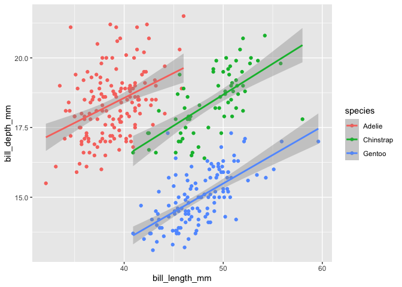

Render This R Script
================
James
May 5, 2021

Penguins penguins penguins  
This is just another R script

    ## [1] "There are  3 penguin species:"

    ## [1] "Adelie"    "Chinstrap" "Gentoo"

``` r
ggplot(penguins, aes(bill_length_mm, bill_depth_mm, col=species)) +
  geom_point() +
  stat_smooth(method='lm')
```

<!-- -->
